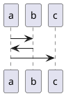

# What is SqlXmlAst-DH?

SqlXmlAst-DH is a gradle project to create a Marklogic datahub for loading, processing 
en publishing SqlXmlAst xml documents.

```plantuml
@startuml
a->b
b->a
a->c
@enduml
```

the end